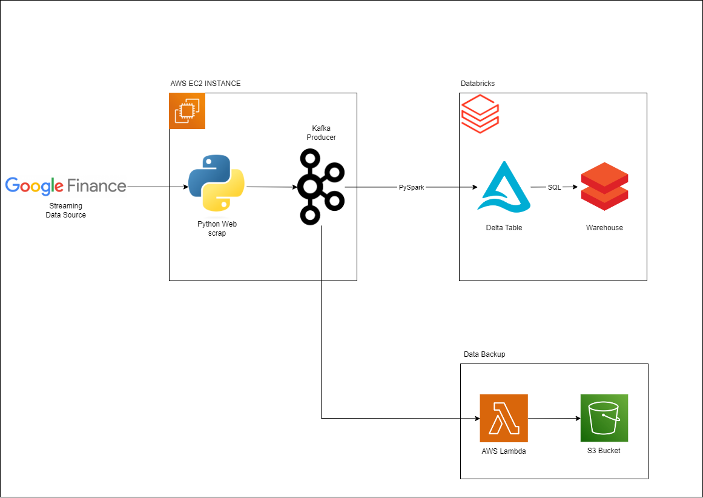

# Real-time Data Engineering Project: Streaming Data Pipeline

Welcome to my real-time data engineering project! This project focuses on building a robust ETL pipeline for real-time data streaming, leveraging technologies like Kafka, PySpark, Delta tables, and AWS services. The goal is to extract, process, and analyze streaming data for advanced analytics.

## Project Overview

The project is structured into several key phases:

1. **Data Extraction with Python Script:**
   I've developed a Python script running on an AWS EC2 instance to extract financial data from Google Finance using web scraping techniques. The extracted data is then cleaned and transformed before being pushed to Kafka topics via a Kafka producer.

2. **Real-time Data Streaming with Kafka Producer:**
   Kafka is used to power the real-time data streaming aspect of the pipeline. By setting up Kafka on AWS EC2 and defining topics, various consumers including PySpark in Databricks can access real-time data for processing.

3. **Consuming Data in Databricks with PySpark and Loading to Delta Table:**
   A PySpark Streaming application within Databricks consumes data from Kafka topics, simultaneously loading it into Delta tables. These tables provide the foundation for efficient data storage, supporting features like low write latency, ACID transactions, and schema enforcement.

4. **Moving to Warehouse for Complex Queries:**
   Once the data is staged in Delta tables, I orchestrate the movement to a data warehouse. This step enables complex queries and advanced analytics, leveraging the optimized storage and query performance of the data warehouse.

5. **Kafka Trigger for Data Backup in S3:**
   Data integrity is maintained through an AWS Lambda function triggered by Kafka events. This function ensures that data from Kafka topics is backed up as CSV files in an S3 bucket, providing a valuable backup of the real-time streaming data.
